# Fab Neo

Fab Neo is a compact milling machine designed for milling circuits boards. The Z axis features a simple flexure based motion system driven by a CAM. The X,Y stages all run on Delrin plain bearings which are easily machined, and driven by Lead screw stepper motors. The spindle is a BLDC motor attached to a bearing block (Modella).

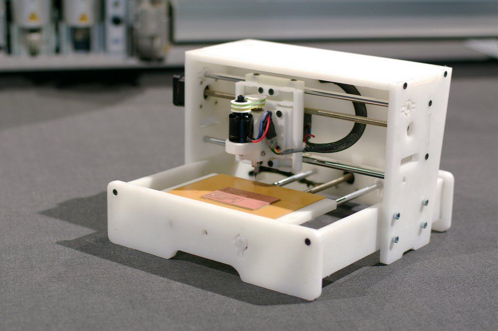

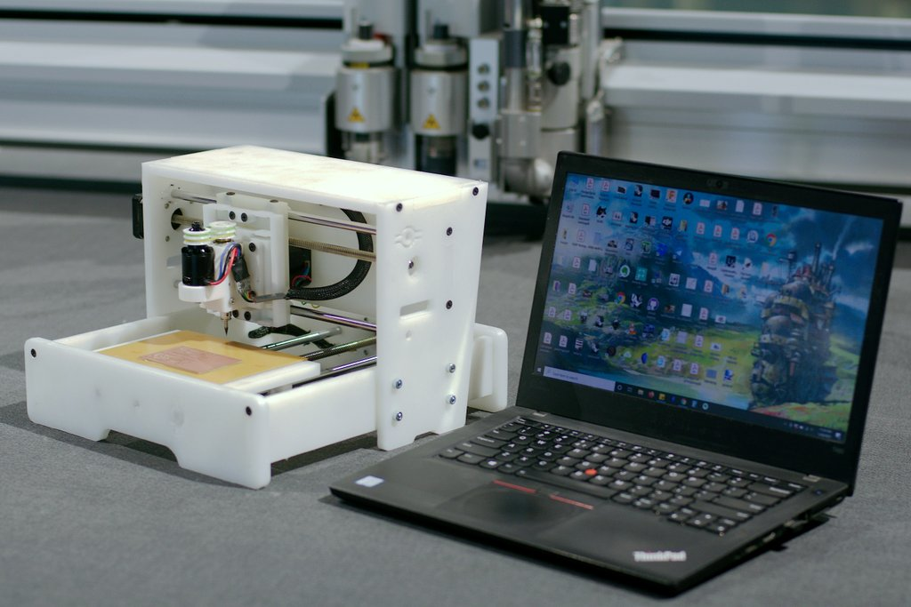

In an effort to simplify the design we started with the Z-axis.

**For PCB mills we only ever need two accurate Z positions.**

1. 0.15 mm depth to mill out the **traces**.
2. 1.8 mm depth to mill out the board and the holes.

**So why would we need a complicated linear stage for essentially 5-10 mm in total Z-travel?** 

Precise motion over small distances are inside the realm of **Flexures.** 

### Flextures 

A basic component of a flexure is a cantilevered beam under load. The constrain with Flexures is that the **motion needs to be linear**. A simple mechanism to achieve this is the **double parallelogram flexure** which has two sets of beams which oppose each others rotational component, giving linear motion.

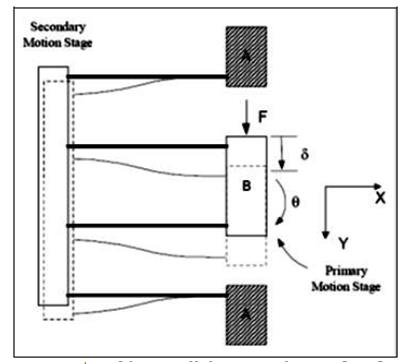

Now that we have a linear slide, we need a way to actuate it.

#### Linear Actuation

The usual actuation methods are Screws or belts each with their own advantages, but considering the small travel range, a **CAM** is best suited for converting the rotary position to linear actuation. 

[Source](https://technologystudent.com/cams/cam10.htm)

The CAM would be connected directly to the stepper's D-shaft, and setscrews to hold them tight. 

### Combination Z-axis

By combining the double parallelogram flexure with a flexurally mounted CAM in the center it is easy to actuate it. This combination drive unit can be milled out of a single piece of plastic.

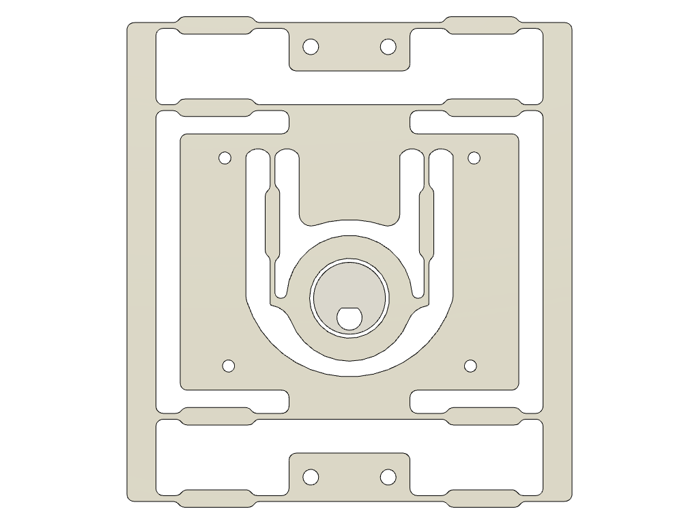

Video of the first successful 3D printed version. The print lasted about 150 continuous revolutions till it broke.

<video height="520" autoplay muted loop>
  <source src="../Images/flex1fmg.mp4" type="video/mp4">
Your browser does not support the video tag.
</video>

3D prints are not durable and fatigue will cause flexure to break after some ~100 revolutions.

#### Various Iterations

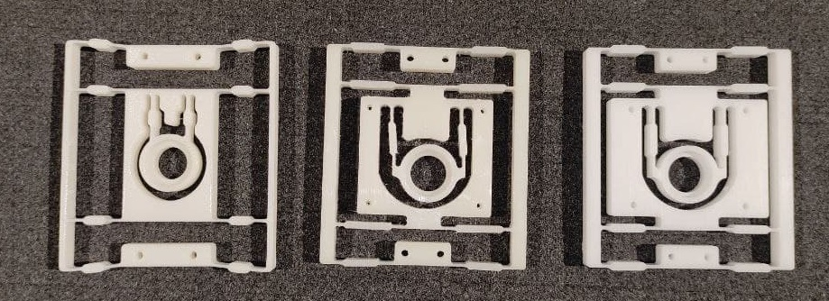

From the left 3D printed, HDPE, Delrin.

Delrin was chosen the material, as it provided a good level of rigidity and fatigue resistance. A 6702 bearing is inserted into the part to provide easy rotation.

In successive iterations the flexure thickness was increased to 1.2 mm and the lengths reduced to provide additional rigidity for out-of-plane forces.

<video width="520" autoplay muted loop>
  <source src="../Images/flex2fmg.mp4" type="video/mp4">
Your browser does not support the video tag.
</video>

### X and Y Linear Motion stages

I used chrome shafts as they are readily available in various diameters. The next part is the making bearings that will move along them.

#### Linear Plain bearing

Plastic plain bearings are simpler to make and if the material is matched to the process, they will last a long time with minimal maintenance. You want materials which do not exhibit the **Stick and Slip** phenomenon when the bearing switches between static and Dynamic modes of friction. 

**Failure Modes**

1. The heat generated form the motion will causes bearings to expand reducing the clearance. They can be solved by either a **metal backing** or by using **lubricants** which reduce the coefficient of friction.

2. Inclusions happen when external debris get trapped inside the bearing and rub against the shaft. Solved by providing a felt ring or rubber seal in front of the bearing.shaft. Also mitigated to an extend by providing **slots in the bearings** to allow for the debris to pass through.

Major challenge in using plastic bearings is maintaining the **bearings clearance**. Too small and they can bind and too large means they will be sloppy.

Bearings can also fail from **edge loading**, if the shafts are not parallel or the force is applied away form the center of stiffness.

#### Bearing material ratings

The **PV value** gives the maximum pressure and velocity values a material can operate at. Often used to compare different materials, they are a function of **load, speed, friction coefficient, and heat dissipation**. PV values should be taken as guidelines as they depend on the testing conditions and do not reflect actual performance.

I've chosen **Delrin** as the bearing material as the material is rigid, Dimentionally stable, easy to machine and it matched well with hardened chrome shafts. Delrin can be structural as well as a bearing.

[General Design Principles Bearing Dupont](https://www.dupont.com/content/dam/dupont/amer/us/en/transportation-industrial/public/documents/en/General%20Design%20Principles%20for%20Bearings.pdf)  
[Guide to plain bearing](https://www.linearmotiontips.com/a-guide-to-plain-bearing-materials-in-linear-motion-applications/)  
[Delrin White paper Dupont](https://www.dupont.com/content/dam/dupont/amer/us/en/transportation-industrial/public/documents/en/DuPont_Delrin(R)_vs_Acetal_Copolymer_White_Paper.pdf)  
[Delrin Design Guide](https://www.spacematdb.com/spacemat/manudatasheets/Delrin%20design%20info.pdf)

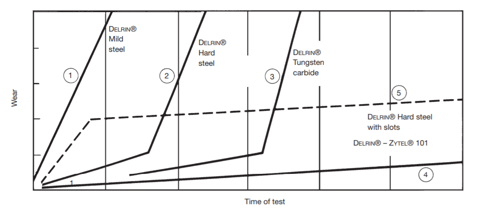
figure provided in the [Delrin Design guide III](https://www.distrupol.com/Delrin_Design_Guide_Mod_3.pdf)

#### The slotted bearing Design

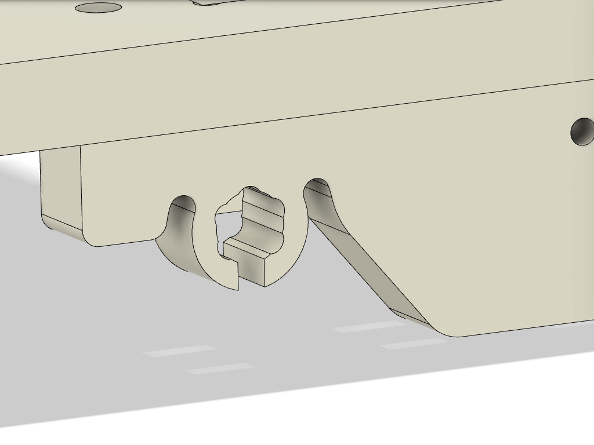

Slots provided to allow for the debris from the milling to flow through without getting wedged in the plastics and dragged across the shafts. A Notch is cut out on the bearing to provide a slight compliance to bearing in case if it is operating in limiting conditions.

**Note**- It is possible to replace the Delrin bushings with **Phenolic Laminates** These are composites of epoxy and cotton fibers, they are harder and lasts much longer, and additional benefit being they can absorb oils and lubricate themselves for a long time.

### Machine Frame Design

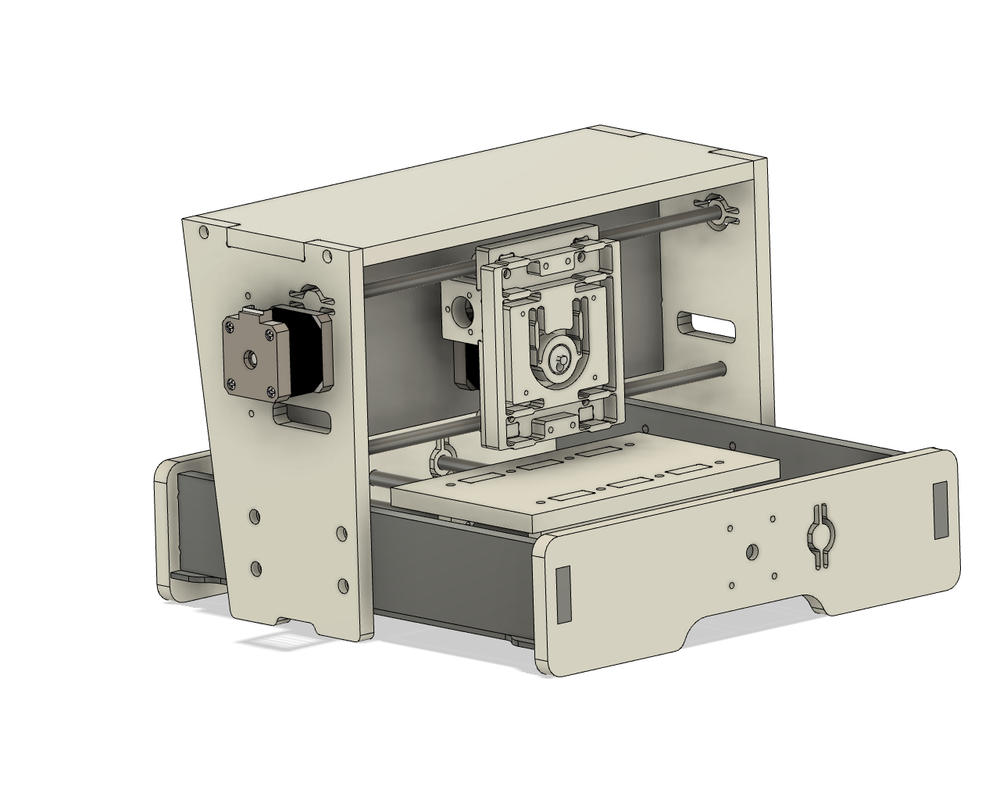

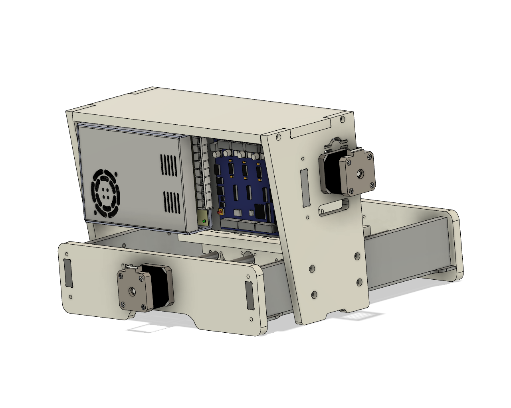

The machine is designed for compactness and rigidity, the strong cross beams resists torsional and lateral forces. It also acts as a mounting plate for the control electronics and power supply.

### Fabrication

The designs were nested in a 80x40 cm sheet of 10 mm HDPE. 

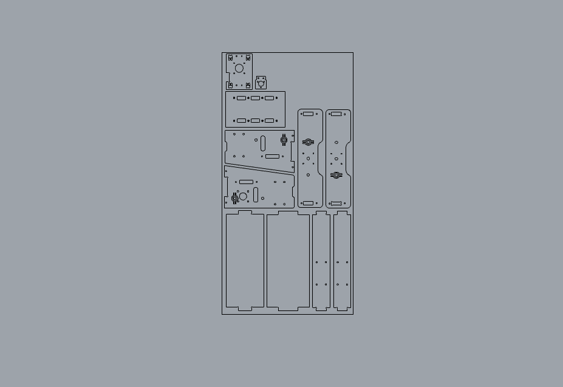

<video width="520" autoplay muted loop>
  <source src="../Images/zund1.mp4" type="video/mp4">
Your browser does not support the video tag.
</video>

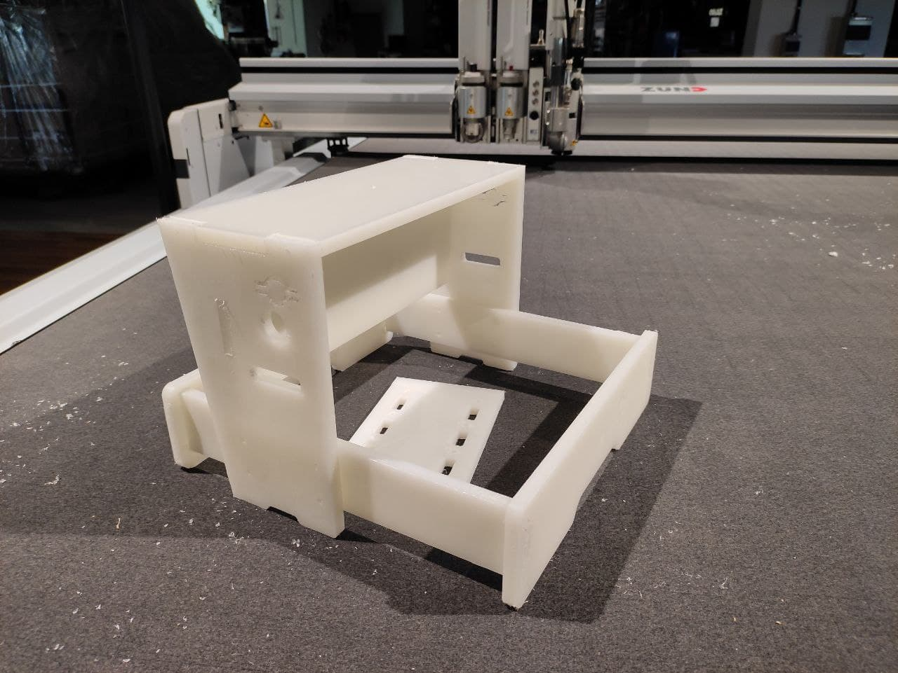

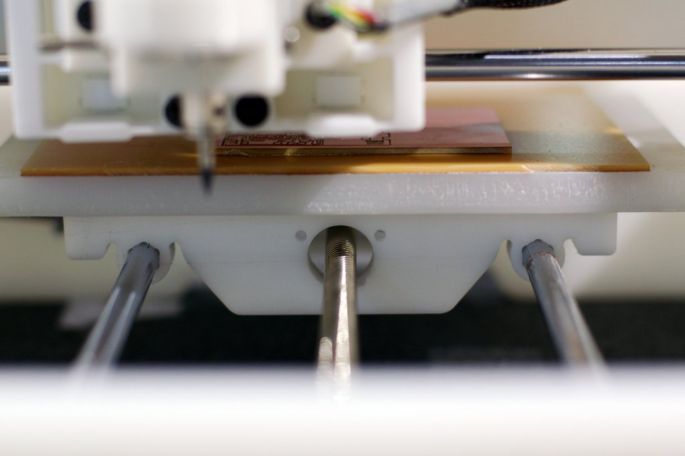

The assembled X stage with the slotted bearing. The stages are driven by lead screw stepper motors with Anti-backlash nuts to provide repeatable motion.

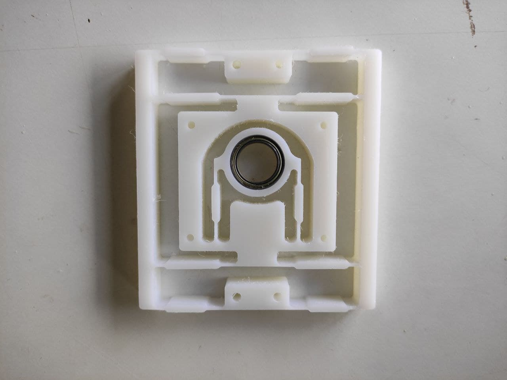

The Z-axis flexure can be milled out in a single piece. Pockets are provided to seat the bearing into the CAM. A **6702 bearing** provides smooth circular motion for the CAM, a sliding contact with proper clearances would also work for this setup, thereby eliminating the bearing.

### Spindle

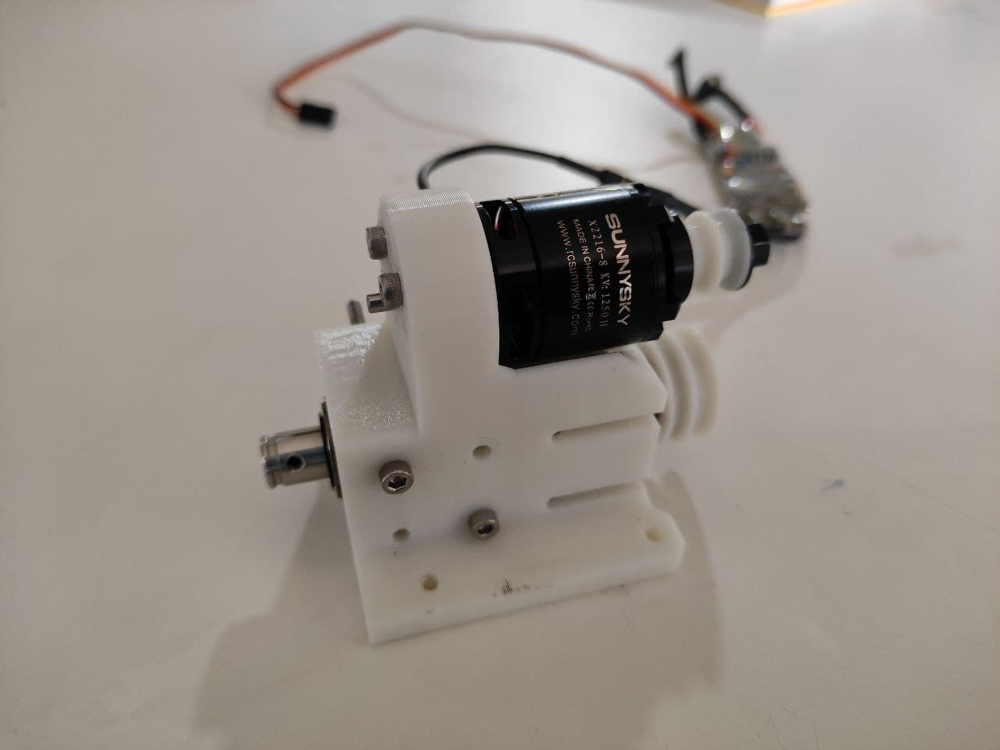
Spindle casing designed by Jogin Francis. 

The **spindle runout** determines the quality and min resolution of the cut. Spindles with poor runout leaves jagged edges in machined parts.

In our case, we had an old replacement spindle for the Modella MDX20 the design is an aluminum block with two bearings mounted at the ends and an 8 mm precision flanged shaft. It can house 3 mm end mills held by set screws.

A BLDC motor with a hobby ESC is used to drive the spindle. Pulleys mounted on top of the motor and spindle are connected with a flexible belt. Using rubber bands for testing, will be replaced by O-rings.

### Fab Neo V1

The machine is compact and smaller than a 15 inch laptop.

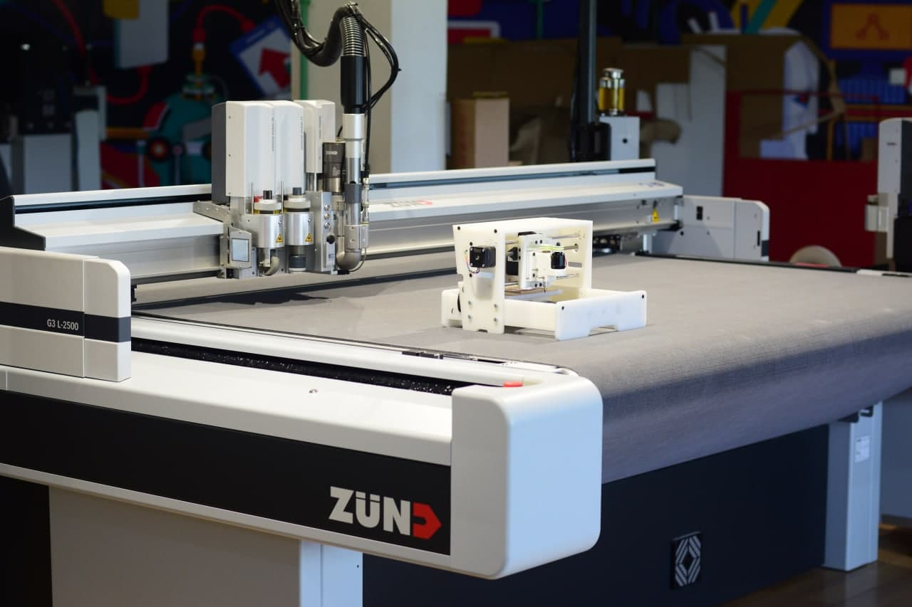

The entire machine was made using the ZUND cutter.

### Inference

<video width="520" autoplay muted loop>
  <source src="../Images/mill1.mp4" type="video/mp4">
Your browser does not support the video tag.
</video>

The initial goal of making a circuit milling machine with a reduced parts list is achieved by specializing the functionalities and using fabricatable motion stages. A flexure based Z-axis which acts as both the motion stage and the actuation is developed as a viable alternative to a conventional machine.

The drawbacks of the design are **reduced rigidity of the mechanism, limited Z travel and -software correctable- non linear motion.** The **life and repeatability with wear** of the plain bearings needs to be studied. Alternate bearing materials can be explored.

Milling traces with 1/64 in end mills give acceptable results at lower feedrates but is not suitable for end mills beyond 1/32 in.

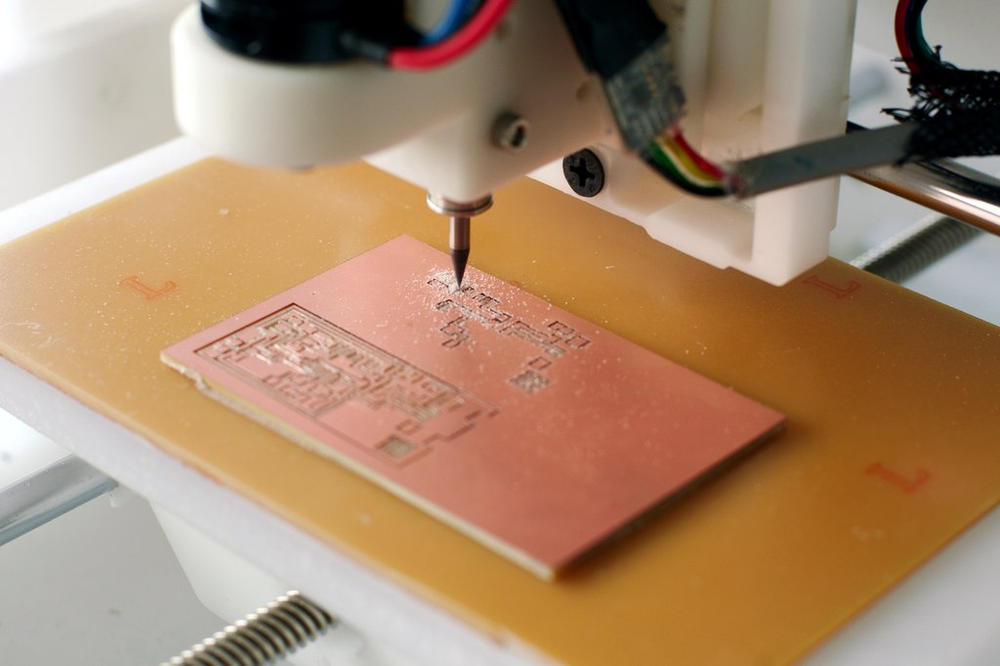

### Learnings

1. Flexures handle in-plane forces better than **out-of-plane forces** which are perpendicular to the Z-plane.
2.  **No hard limits** are presents problems with initialization of Z height.
3. Improve Bed leveling and rigidity. 8 mm rods supported at 300 mm will bend in the middle.
4. Replace Y-axis lead screw connection to improve rigidity and reduce backlash from bending.
5. **Fatigue and Creep effects** of plastics need to be taken into account for lifetime calculation.
6. Accurate **bearing clearance** to be maintained overtime. Explore possibility of split bearings.

### Optimization

#### 1. Sandwich panel for out of plane forces

An approach we can take is to constrain the flexure with a rigid member to reduce deflections due to moment forces. 

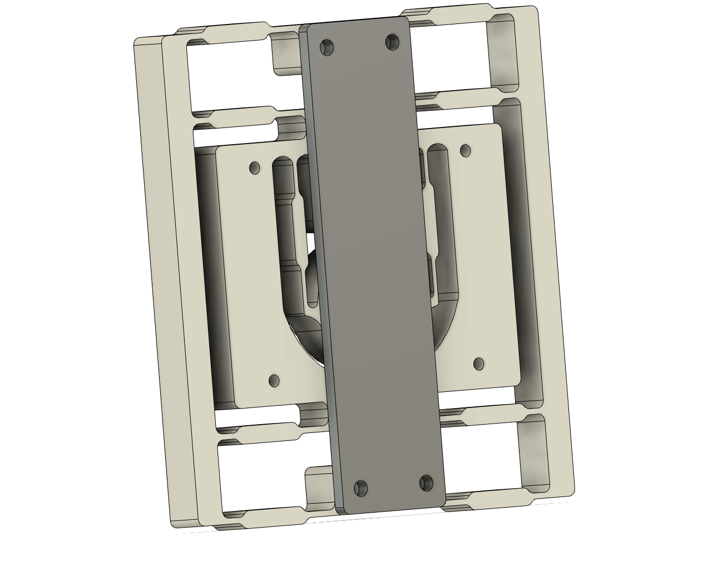

The panel must be made from some stiff material, first trials will be with 3 mm Aluminum. As Delrin is self-lubricating, this sliding motion should not be a problem.

#### 2. Increasing flexure life

The nonlinear static stress simulations in fusion 360 helped show the various stress values at different points of the structure.

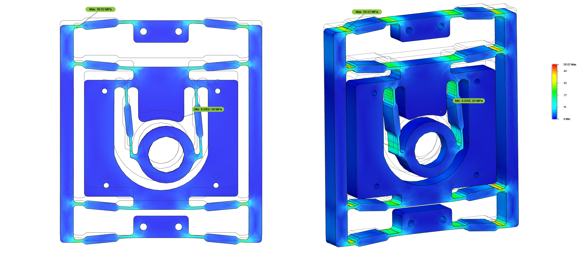
**Load: 35N downward, 10N sideways | Deflection: 4.7mm | Max stress: 50Mpa**  

<video height="320" autoplay muted loop>
  <source src="../Images/stress1.mp4" type="video/mp4">
Your browser does not support the video tag.
</video>

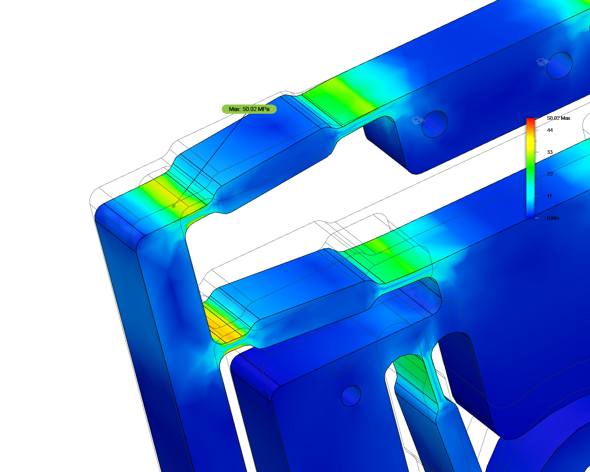

The yield strength of Delrin (depending on the grade used) is around 60-70 Mpa. This puts us very close to the limit, with a **factor of safety of only 1.30.** Any value less than 3 is not ideal and will fail prematurely.

#### Fatigue and Creep

**Fatigue** happens when a material is stressed cyclically and at high levels close to its tensile strength. 

A way to keep the material form fatigue failure is to keep the stresses under the **fatigue limit.**

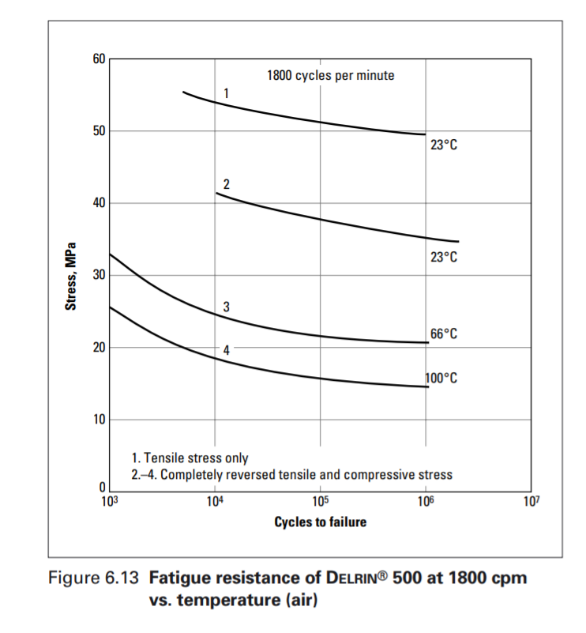

[Source: Dupont design document](https://www.spacematdb.com/spacemat/manudatasheets/Delrin%20design%20info.pdf)

From the graph, if we can keep the stress in the material under **35 Mpa** and at room temperature, we can have a near infinite loading cycle.

**Creep** is the gradual increase in deflection of a material subject to a constant load for a long time. 

[Source: Dupont design guide](https://www.distrupol.com/Delrin_Design_Guide_Mod_3.pdf)

Due to the nature of our design, **one of the flexure will always be in deflection**. Creep can occur most prominently at the vertical flexures of the Cam, as it is mostly likely to be in the bend position over time. Creep can also occur if the Cam is made form plastic.

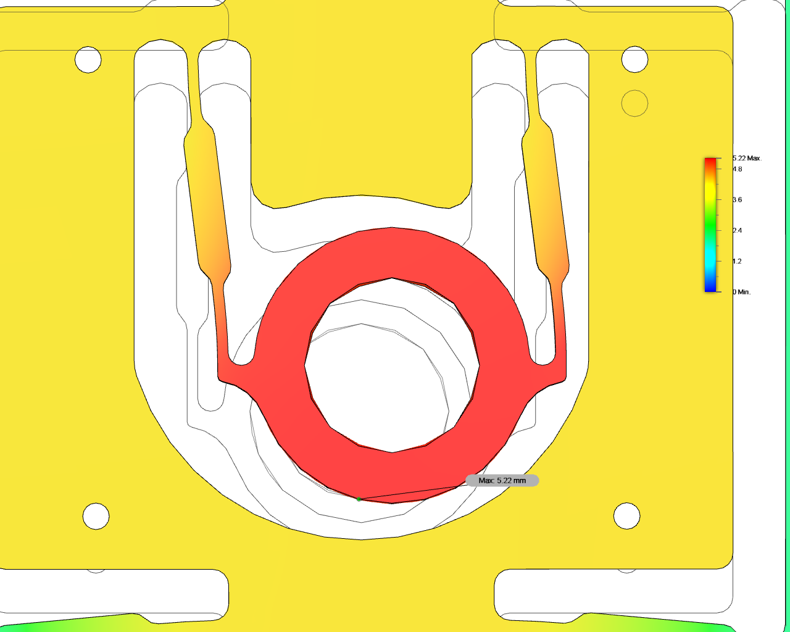

The worst case would be if creep cause the **vertical flexures to buckle** under load, 

#### Z Flexure version 2

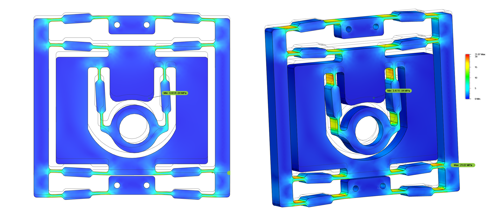

From the previous simulation, the stresses in the material is close to **50 Mpa**. In the second version, I've increased the thickness of the flexure to **1.6 mm** and the total width by **10 mm.** 

To prevent the full rotation of the Cam, the top supports are dropped on both sides, this will act as a hard limit. The length and width of the vertical flexures are increased by **5 mm, and 1.4 mm** to reduce stress.

The net result is that, the total stresses in the part dropped form **50 Mpa to 28 Mpa**, which is well under the fatigue limit and can be reasonably assumed to work 10^6 cycles.

### Future Improvements

1. Design Micro Spindle for PCB Mill with 2205 BLDC motors.
2. Making machine user friendly, Tool setter/Z bed leveling/Manual controls.
2. Homing and Hard limit on the Z axis.
2. Software correction for Z axis linearity.
3. Move from 8 mm rods to 12 mm smooth rods.
4. Explore different ways to counter out-of-plane forces in the flexure.
5. Explore ways to minimize creep in plastic over long time.
6. Explore self aligning options in bearings and ways to compensate for wear.

### BOM

| Sl no | Item | Description | Qty |
|:-:|:-:|:-:|:-:|
| 1 | Nema 17 Lead screw Stepper motor | For X and Y axes | 2 |
| 2 | Nema 17 D shaft stepper motor | For Z axis | 1 |
| 3 | Hard chrome shaft 8 mm dia 300mm Length | For linear slides | 4 |
| 4 | Delrin 10mm 20x20cm | plain bearings | 1 |
| 5 | HDPE 10mm 80x40cm | Frame | 1 |
| 6 | M4x15 Plastic screws (large thread) | Fasteners for body | ~40 |
| 7 | M3x15 SHCS | Lead screw nut | ~10 |
| 8 | M3,M5 washers | Washers for all bolts | ~20 |
| 9 | M5x15 SHCS | Connecting top and bottom of frame | 8 |
| 10 | 15V 150W power supply | Can be turned up to 18V  | 1 |
| 11 | Tiny G/Machine controller | Machine control | 1 |

